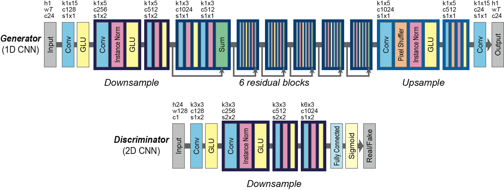

# Voice Converter CycleGAN

This repository contains a pytorch implementation of the model: [CycleGAN-VC - Parallel-Data-Free Voice Conversion
Using Cycle-Consistent Adversarial Networks](http://www.kecl.ntt.co.jp/people/kaneko.takuhiro/projects/cyclegan-vc/). 

    

## TODO
- [x] Generator
- [x] Discriminator
- [x] CycleGAN
- [ ] train
- [ ] data processing
- [ ] main
- [ ] utils

## Reference
[Gated CNN](https://github.com/jojonki/Gated-Convolutional-Networks)

[Tensorflow CycleGAN-VC](https://github.com/leimao/Voice_Converter_CycleGAN)